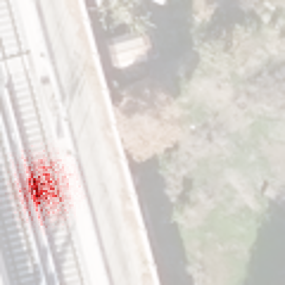
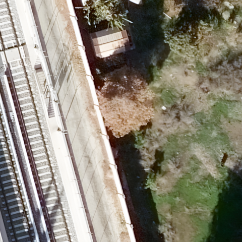
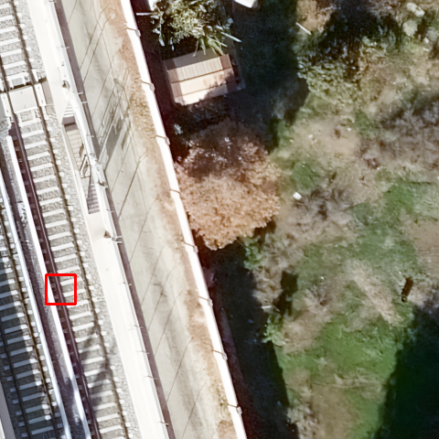
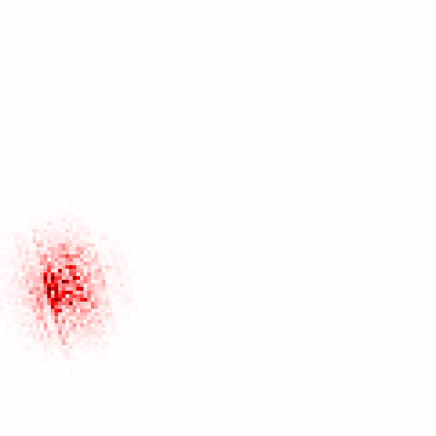
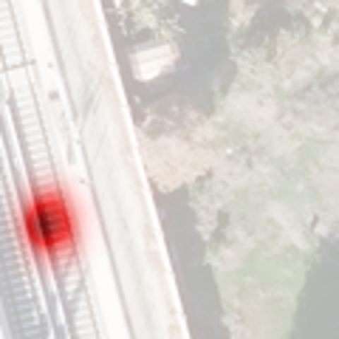

# Local Attribution Map for Super-Resolution (LAM)

## Project Introduction 项目简介

This project is an unofficial implementation of Local Attribution Map for Super-Resolution (LAM). Considering the original project has a certain level of difficulty for beginners and is incompatible with PyTorch 2024, we provide a LAM implementation algorithm with detailed instructions. It aims to help researchers conduct advanced research in the field of super-resolution more efficiently, save time, and jointly promote technological progress.

本项目是对 Local Attribution Map for Super-Resolution (LAM) 的一个非官方实现。鉴于原项目存在一定的上手难度，并且不兼容2024年广泛使用的 PyTorch版本，我们提供了一个包含详细说明的 LAM 实现算法，旨在帮助研究者们更高效地开展超分辨率领域的先进研究，节约时间，共同促进技术进步。


## Paper Link 论文地址

[(https://arxiv.org/abs/2011.11036)](https://arxiv.org/abs/2011.11036)


### Introduction 简介

The Local Attribution Map (LAM) is an interpretability tool for super-resolution reconstruction tasks. It can locate the pixels in the low-resolution input image that contribute most to the network's super-resolution results. LAM highlights the pixels that contribute most to the super-resolution result by tracking the information used by the model, given the local area of the specified super-resolution result.

局部归因图（Local Attribution Map，LAM）是一种用于超分辨率重建任务的可解释性工具。它能够定位低分辨率输入图像中对网络超分辨率结果贡献最大的像素。LAM 通过跟踪模型使用的信息，在指定超分辨率结果局部区域的前提下，高亮显示对超分辨率结果贡献最大的像素。

 

### Quick Start 快速上手

To run this project, simply execute the following command:
要运行本项目，只需执行以下命令：

```bash
python main.py
```

#### Testing Your Own Model 测试自己的模型

1. Place the images to be tested in the `testimg` folder. 将待测试图片放入 `testimg` 文件夹。
2. Place the super-resolution model and corresponding weight in the `model` folder. 将超分辨率模型和对应的权重文件放入 `model` 文件夹。
3. Modify the below code in the `main.py` file to introduce your own model and set appropriate parameters. 修改以下`main.py` 文件中的代码，引入自己的模型，并设置合适的参数。

```python
from model.SRmodel.edsr import EDSR
model = EDSR().to("cuda").eval()
```

#### Parameter Description

- `--modelpath`: Path to the model weights. 模型权重路径。
- `--imgpath`: Path to the test image. 测试图像路径。
- `--w`: The x-coordinate of the selected area. 选择区域的 x 坐标。
- `--h`: The y-coordinate of the selected area. 选择区域的 y 坐标。
- `--window_size`: The size of the selected area. 区域大小。
- `--fold`: The number of path integral steps. Higher values are closer to the true value. Default is 50, not recommended to modify. 路径积分步数，越高越接近真实值，默认 50，不建议修改。
- `--sigma`: Path integral parameter, not recommended to modify. 路径积分参数，不建议修改。
- `--l`: Path integral parameter, not recommended to modify. 路径积分参数，不建议修改。
- `--alpha`: Alpha value for blending. 混合时的 alpha 值。
- `--zoomfactor`: Image scaling factor (SR scale), default is 4. 图像缩放因子（SR 倍率），默认4。
- `--kde`: Whether to use KDE for visualization (requires high computer performance and longer time). 是否使用 KDE 进行可视化（对电脑性能要求较高，时间较长）。
- `--output_dir`: Output image directory. 输出图片目录。

#### Model Weights of SOTA Super-Resolution Method 常用超分辨率模型权重下载
[Tang1705](https://github.com/Tang1705/Local-Attribution-Maps-for-Super-Resolution/releases/tag/Weights)

### Output Results 输出结果


| Original Image | Attribution Area | Super-Resolution Result |
|------------|--------------------------------|---|
|  |  |  |
| LAM Result | Blended Result | KDE Clustering Result |
|  |  |  |


## Q&A

**Q**: I conducted attribution on an SR model, but some models like SwinIR generated a pure black image after attribution. Why is this? 我对 SR 模型进行了归因，但某些模型如 SwinIR 归因后生成了一张纯黑色的图，这是为什么？

**A**: Some improper model designs may affect the gradient backpropagation relied on by LAM. For example, designs in the `MeanShift` class may affect gradient propagation. Directly removing these components may be a solution. 一些不当的模型设计可能会影响 LAM 所依赖的梯度反传。例如，`MeanShift` 类中的设计可能会影响梯度传播。直接移除这些部件可能是一种解决方案。

```python
class MeanShift(nn.Conv2d):
    def __init__(
        self, rgb_range,
        rgb_mean=(0.4488, 0.4371, 0.4040), rgb_std=(1.0, 1.0, 1.0), sign=-1):

        super(MeanShift, self).__init__(3, 3, kernel_size=1)
        std = torch.Tensor(rgb_std)
        self.weight.data = torch.eye(3).view(3, 3, 1, 1) / std.view(3, 1, 1, 1)
        self.bias.data = sign * rgb_range * torch.Tensor(rgb_mean) / std
        for p in self.parameters():
            p.requires_grad = False
```

## Code References 代码编写参考

During the development of this project, the following open-source projects were referenced. Thanks to their contributions to the open-source community:
本项目在开发过程中参考了以下开源项目，感谢他们对开源社区的贡献：

- [Official Implementation of LAM](https://github.com/X-Lowlevel-Vision/LAM_Demo)
- [Local Attribution Maps for Super-Resolution](https://github.com/Tang1705/Local-Attribution-Maps-for-Super-Resolution)


## Citation 引用

When using LAM, please cite the following article:
在使用 LAM 时，请引用以下文章：

```bibtex
@inproceedings{gu2021interpreting,
  title={Interpreting super-resolution networks with local attribution maps},
  author={Gu, Jinjin and Dong, Chao},
  booktitle={Proceedings of the IEEE/CVF Conference on Computer Vision and Pattern Recognition},
  pages={9199--9208},
  year={2021}
}
```

